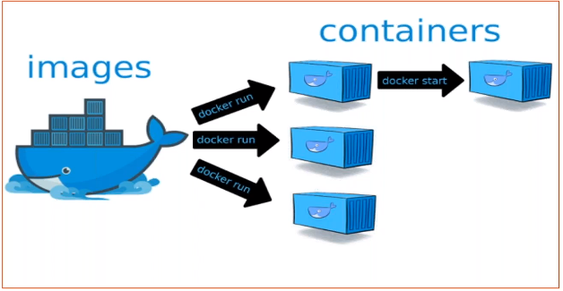
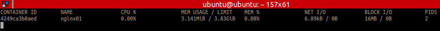
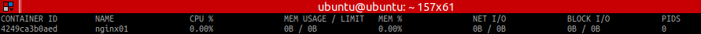

# Curso Docker - KeepCoding

## 0. Inicio

## 1. Introducción

### 1.1 Introducción a Contenedores y Docker
- Industria software ha cambiado:
- Antes
    - App monolíticas.
    - Largos ciclos de desarollo.
    - Entorno único.
    - Escalado lentamente.
- Ahora
    - Servicios desacoplados.
    - Mejoras rápidas e iterativas.
    - Múltiples entornos.
    - Escalar rápidamente.
- Implementación se vuelve muy compleja
- Muchos conocimientos diferentes
    - Lenguajes
    - Frameworks
    - BBDD
- Muchos entornos diferentes
    - Entornos de desarroll individual.
    - Preproducción, QA, integración, etc.
    - Producción: cloud e hybrid.
- Docker es una herramienta de código abierto.
- Dos versiones: Community Edition (+ usada) y Enterprise Edition (+ estable y con soporte).
- Paquetizar todas las aplicaciones y poder usarlas en cualquier SO.
- Permite ensamblar apps rápidas y elimina problemas que pueden ocurrir al enviar el código pudiendo subir a producción de manera más rápida y eficaz.

### 1.2 Características
- **Ligero**: los contenedores de una máquina comparten el mismo Kernel. Esto no ocurre con las MVs.
- **Portable**: el proceso que se arranca con el sistema de ficheros lleva todas las dependencias para que la aplicación funcione en cualquier máquina a la que se porte.
- **Inmutable**: si funciona en el equipo de desarrollo, funcionará en todos los equipos donde se ejecute.
- Docker trabaja con un lema: **Build, ship and run any app, anywhere**. (Generar los contenedores, transportarlos y ejecutarlos)
- ¿Qué aporta?
    - Escalabilidad: horizontal (añadiendo nodos como sean necesarios) y vertical (portando el contenedor a una máquina con + recursos). 
    - Portabilidad

### 1.3 Componentes de Docker
- Arquitectura muy modular: muchos componentes, algunos de muy alto nivel, que permiten personalizar bastante Docker.
- Componentes principales:
    - **Cliente**
        - El usuario interactúa con el demonio por medio del cliente.
        - Suele utilizarse la línea de comandos.
        - Tiene API. Permite escribir programas que interactuen directamente con el demonio sin usar el cliente.
        - Se usa para hablar con el dominio a través del protocolo HTTP.
    - **Demonio**
        - Proceso principal de gestión del _engine_. 
        - Corre en la misma máquina anfitriona. No siempre tiene que estar instalado en la máquina, y como cliente nos podemos conectar al demonio y lanzar instrucciones. - Responsable de crear, ejecutar y monitorizar los contenedores. También de construir y almacenar las imágenes. 
        - Todas las instrucciones se lanzan contra este.
        - Acepta peticiones y crea imágenes.
    - **Registry**
        - Almacenan y distribuyen imágenes.
        - Predeterminado: Docker Hub. 


### 1.4 Concepto de contenedores
- **Contenedores**
    - Proceso aislado al resto de procesos del sistema. 
    - Paquete que contiene una app y todo el software necesario para que se ejecute.
    - Teniendo instalado Docker Engine se pueden ejecutar tantos contenedores como se desee.
    - Es ejecutado por el kernel del host, como una app más pero de forma aislada del resto ya que tiene su propio sistema de ficheros.
    - Dispone de su propio espacio de usuario (atributos, ids, grupos, etc).
    - Dispone de su propio espacio de procesos: provee opción de suspensión y recuperación de procesos en la misma máquina o al migrarse.
    - Se pueden compartir espacio de ficheros con la máquina host, o espacio de usuarios y procesos con otros contenedores.


### 1.5 Diferencia entre contenedores y máquinas virtuales
- Virtualización
    - Máquina virtual: virtualización del entorno de ejecución para ejecutar aplicaciones.
    - Virtualización del hardware
- El contenedor tiene lo escencial para ejecutar la aplicación. 
- Una MV tiene todo el SO y dentro de este se pueden instalar diferentes servicios, con el consiguiente consumo que supone.
- Entorno virtualizado
    - Varios SOs.
    - SO invitado. Es el que se ejecuta sobre el HW virtualizado. 
    - Ventajas
        - Ejecucción de un SO diferente al instalado.
        - Posibilidad de clonar y mover la MV de un ordenador físico a otro.
        - Aprovechamiento de recursos con varios _guests_ en un mismo host.
    - Inconvenientes
        - Rendimiento.
        - Nº de sistemas corriendo en la misma máquina.


### 1.6 ¿Por qué son tan eficientes los contenedores?
- Un contenedor no necesita hipervisor.
- Un contenedor es un paquete. Contiene una aplicación y todo el sw necesario para ejecutarlo.
- El contenedor se ejecuta directamente por el kernel del host.

## 2. Instalación

### 2.1 Docker en los distintos sistemas operativos


### 2.2 Instalar Docker en Linux
- Guía de instalación: https://docs.docker.com/install/
- Máquina virtual
    - **Usuario**: Ubuntu_1804
    - **Contraseña:** password
- Instalación (seguir web)
```bash
sudo apt-get update
sudo apt-get install \
    apt-transport-https \
    ca-certificates \
    curl \
    gnupg-agent \
    software-properties-common
curl -fsSL https://download.docker.com/linux/ubuntu/gpg | sudo apt-key add -
sudo apt-key fingerprint 0EBFCD88
sudo add-apt-repository \
   "deb [arch=amd64] https://download.docker.com/linux/ubuntu \
   $(lsb_release -cs) \
   stable"
sudo apt-get update
sudo apt-get install docker-ce
```

- Probar funcionamiento
    - **Run** ejecuta el contenedor listado a continuación del comando.
```bash
sudo docker run hello-world
```

- Añadir al usuario para que no utilice sudo
```bash
sudo groupadd docker
sudo usermod -aG docker $USER
```
### 2.3 Primer Contenedor
```bash
docker run hello-world
```

## 3. Empezando con Docker

### 3.1 Comandos Docker
- Docker asigna nombres aleatorios a los contenedores (si no le asignados uno antes).
- Ayuda
    - Están agrupados por funcionalidades.
```bash
$ docker help
$ docker COMMAND --help
$ docker container --help
$ docker container ls
$ docker container ls --help
$ docker rm zealous_golick
$ docker image --help
$ docker image ls -a
$ docker image rm hello-world -f
$ docker version
$ docker search ubuntu
```

### 3.2 Imágenes y contenedores
- **Imagen**
    - Conjunto de ficheros que contiene todos los elementos necesarios para que la imagen pueda ser ejecutada.
    - NO tienen estado.
    - NUNCA cambian, son fijas, siempre. NO se pueden modificar.
    - Cada vez que se ejecuta un **docker run** de una imagen, se genera un nuevo contenedor.
    - Se pueden ejecutar varios contenedores de la misma imagen.
    - "Plantilla base"
- **Contenedor**
    - Instancia en ejecución de una imagen.
    - SI tiene estados (arrancado, pausado, detenido o terminado) y se puede modificar (añadir ficheros, por ej).
    - Se puede modificar su contenido e información estando en ejecución.
    - "Ejecución de la plantilla".
- **Comandos**
    - Imágenes
        - **Pull**: bajar la imagen.
        - **Push**: se genera imagen y se sube.
        - **Build**: crear imágenes.
        - **Save**: guardar imagen.
        - **Load**: cargar imagen guardada.
    - Contenedores
        - **Run**
        - **Stop**
        - **Start**
        - **Restart**
        - **Inspect**
        - **Stats**



### 3.3 Docker Store - Docker Hub
- Las imágenes se descargan de:
    - Docker Store
    - Docker Hub

```bash
# Descarga una versión específica de Ubuntu
$ docker pull ubuntu:16.04 
```

### 3.4 Comandos para contenedores
```bash
$ docker ps -a # Se está deprecando, mejor usar ls

# Lista de directorio raíz todos los ficheros y directorios.
$ docker container run ubuntu ls -ltr 

# Lo mismo que el anterior pero de la versión anterior de UBuntu
$ docker container run ubuntu:16.04 ls -ltr

# Cambiar nombre (NAMES) por el que se escoja
$ docker container run --name miubuntu ubuntu:16.04 ls -ltr

# Ejecutar contenedor y dejarlo arrancado
$ docker container run --name ultimoubuntu ubuntu top -b

# Detener el contenedor que se está ejecutando
$ docker container stop 1506bd3b402b

# Ejecutar contenedor y dejarlo arrancado en segundo plano (detach)
$ docker container run -d --name ubu ubuntu top -b

# Arranca una máquina con la que se puede ejecutar comandos en Bash
$ docker container run -it ubuntu:16.04 bash

# Ver logs que genera el contenedor
## Muestra los logs hasta el momento de ejecutar el comando
$ docker container logs --details 09af5050365f
## Muestra los logs en tiempo real (follow)
$ docker container logs -f 09af5050365f

# Detalles del contenedor
$ docker inspect nombreContenedor 

## Ir a una propiedad en concreto
$ docker inspect --format='{{.Name}}' infallible_rubin
$ docker inspect --format='{{.NetworkSettings.SandboxKey}}' infallible_rubin

# Se para pero no se borra
# Se pueden parar varios a la vez
$ docker stop <contenedor>

# Arranca un contenedor parado
$ docker start <contenedor>

# Lista todos los IDs de los contenedores y los borra
#  -q, --quiet           Only display numeric IDs
$ docker container stop `docker container ls -q`
$ docker container stop $(docker container ls -q)

# Borra un contenedor (o varios)
#   -f  Borra un contenedor aunque no esté parado
#   -v  Borra el contenedor y sus volúmenes
$ docker container rm <contenedor>
$ docker container rm `docker container ls -qa`
$ docker container rm $(docker container ls -qa)

# Ejecuta comandos dentro del contenedor
$ docker exec <contenedor> ls -ltr

# Activa shell dentro del contenedor y es como si estuvieras dentro de él. 
# Se podrán ejecutar comandos dentro de este.
#   -i, --interactive   Keep STDIN open even if not attached
#   -t, --tty           Allocate a pseudo-TTY
# Utilizando "exit" se mantiene la sesión corriendo
# 
$ docker exec -it <contenedor> sh 

# Copiar ficheros del contenedor local
$ docker cp <contenedor>:/sbin/tune2fs ./

# Estadísticas
$ docker stats <contenedor>
```
**Contenedor arrancado** 


**Contenedor detenido**


```bash
# Borra contenedores parados, imágenes y volúmenes que no se utilizan.
# NO USAR EN PRODUCCIÓN
$ docker system prune
```

### 3.5 Empezando con Docker - Ejercicio 1
1. Descargar imagen de Nginx en su última versión.
2. Ejecutar el contenedor en *segundo plano* para poder acceder al servidor por el puerto 80 en el navegador.
3. Acceder desde un navegador a http://localhost
4. Ejecutar otro contenedor para poder acceder por el puerto **8081** en el navegador.
5. Listar los contenedores activos.

**Respuesta**
```bash
# 1
$ docker container pull nginx

# 2
# -p80:80 significa que el puerto 80 de docker (segundo valor) se expone en el puerto 80 (primer valor) del anfitrión.
$ docker run -d -p80:80 --name nginx80 nginx
$ docker run -d -p8085:80 --name nginx80 nginx

# Cambiar el fichero default
$ docker cp /home/ubuntu/index.html nginx80:/usr/share/nginx/html/index2.html

# 4
$ docker run -d -p8081:80 --name nginx8081 nginx

# 5
$ docker container list
```

### 3.6 Resumen
- Imagen Alpine
    - Basada en Alpine Linux.

```bash
$ docker container run alpine echo "Hola mundo!"

# Múltiples utilidades de poco peso
$ docker container run busybox ls -l
```

### 3.7 Comandos para imágenes
```bash
# Listado de imágenes
#   -q      Devuelve únicamente los IDs de todas las imágenes.
$ docker images

# Ayuda para salvar imágenes
$ docker image save --help
$ docker image save --output <fichero> <imagen:label>
$ docker image save --output fichero_imagen_alpine alpine
# Guarda la imagen comprimida en .tar
$ docker image save  alpine > miAlpine.tar

# Elimina imagen
#   -f      Fuerza eliminación
$ docker image rm <imagen:label>
# Elimina TODAS las imágenes descargadas.
$ docker image rm `docker image ls -q` 

# Carga imagen
#   -i      Carga imágenes comprimidas en .tar
$ docker image load --help
$ docker image load <fichero>
# Carga una imagen comprimida en .tar
$ docker image load -i miAlpine.tar
```

### 3.8 Empezando con Docker - Ejercicio 2
1. Ejecuta el contenedor de la última versión de la imagen busybox asignando el nombre "muBusyBox" al contenedor creado en modo shell.
2. Listar todos los contenedores activos.
3. Mostrar estadísticas del contenedor myBusyBox.
4. Hacer copia de un fichero a local.
5. Guardar la imagen en un fichero con nombre **imagen_busybox.tar** para poder transportarla.
6. Borrar la imagen descargada.
7. Obtener la IP asignada al contenedor.

**Respuesta**
```bash
# 1
$ docker pull busybox
$ docker run --name myBusyBox -it busybox sh
# ctrl + p + q 

# 2
$ docker ps
$ docker container attach myBusyBox

# 3
$ docker stats myBusyBox

# 4
$ docker container cp myBusyBox:/etc/hosts ~/

# 5
$ docker image save busybox > ~/imagen_busybox.tar

# 6
$ docker container rm `docker container ls -qa`
$ docker image rm busybox

# 7
$ docker inspect myBusyBox
$ docker inspect --format='{{.NetworkSettings.IPAddress}}' myBusyBox

# Alternativa si está arrancada
$ docker pull busybox
$ docker run --name myBusyBox busybox ifconfig # 172.17.0.2

```

### 3.9 Empezando con Docker - Ejercicio 3
1. De la carpeta /examples/3.EmpezandoConDocker/ cargar las imágenes imagen1.tar.gz e imagen2.tar.gz
2. Obtener el nombre y la versión de cada una de las imágenes.
3. Arrancar en modo *detach* la imagen 2 y ver los logs que va generando.
4. Parar el contenedor de la imagen 2.

**Respuesta**
```bash
# 1
$ gzip -d imagen.tar.gz
$ docker image load -i imagen.tar
$ gzip -d image2.tar.gz
$ docker image load -i imagen2.tar

# 2
$ docker image inspect --format='{{.RepoTags}},{{.DockerVersion}}' alpine
$ docker image inspect --format='{{.RepoTags}},{{.DockerVersion}}' mongo:4.1

# 3
$ docker container run -d mongo:4.1
$ docker container logs -f f4769a9d1f2d
$ docker container logs --details f4769a9d1f2d

# 4
$ docker container stop f4769a9d1f2d
```

## 4. Creación de imágenes

## 5. Manejando volúmenes

## 6. Aplicaciones multicontenedor - Docker compose

## 7. Docker Registry

## 8. Trabajando con Docker en entornos de desarrollo

## 9. Kubernetes