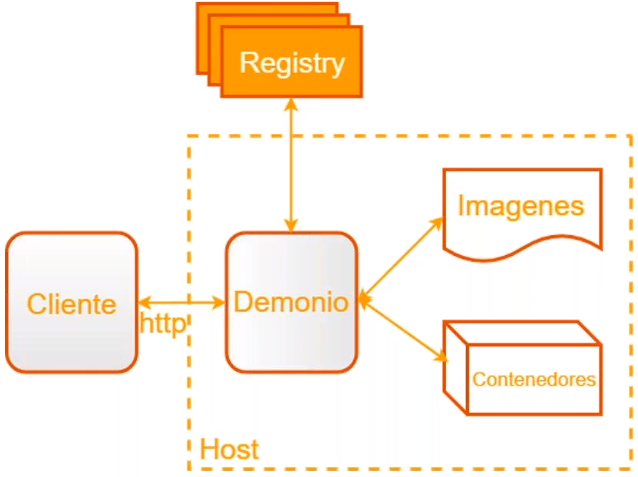
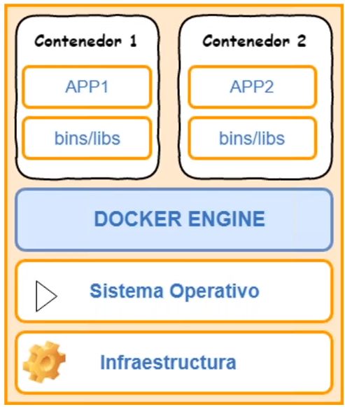
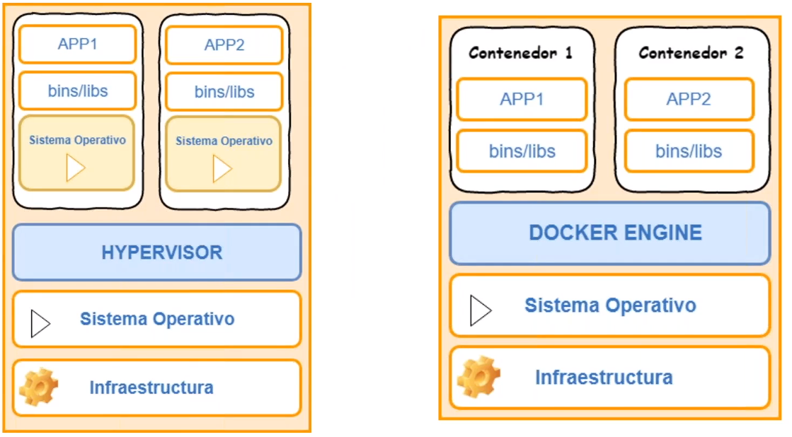
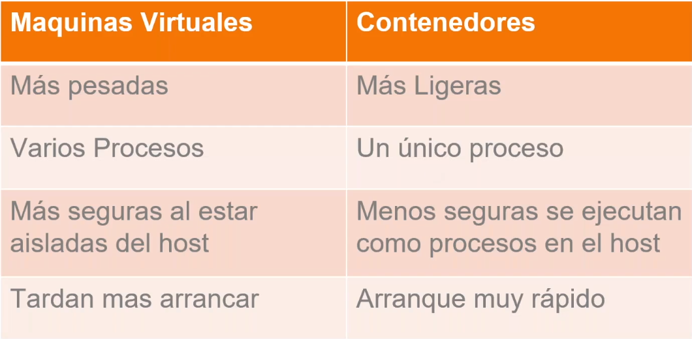
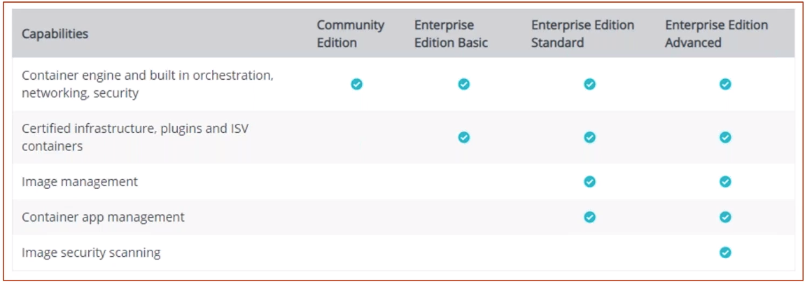
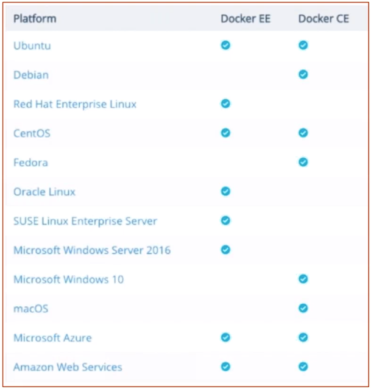

# Curso Docker - KeepCoding

## 0. Inicio

## 1. Introducción

### 1.1 Introducción a Contenedores y Docker
- Industria software ha cambiado:
- Antes
    - App monolíticas.
    - Largos ciclos de desarollo.
    - Entorno único.
    - Escalado lentamente.
- Ahora
    - Servicios desacoplados.
    - Mejoras rápidas e iterativas.
    - Múltiples entornos.
    - Escalar rápidamente.
- Implementación se vuelve muy compleja
- Muchos conocimientos diferentes
    - Lenguajes
    - Frameworks
    - BBDD
- Muchos entornos diferentes
    - Entornos de desarroll individual.
    - Preproducción, QA, integración, etc.
    - Producción: cloud e hybrid.
- Docker es una herramienta de código abierto.
- Dos versiones: Community Edition (+ usada) y Enterprise Edition (+ estable y con soporte).
- Paquetizar todas las aplicaciones y poder usarlas en cualquier SO.
- Permite ensamblar apps rápidas y elimina problemas que pueden ocurrir al enviar el código pudiendo subir a producción de manera más rápida y eficaz.

### 1.2 Características
- **Ligero**: los contenedores de una máquina comparten el mismo Kernel. Esto no ocurre con las MVs.
- **Portable**: el proceso que se arranca con el sistema de ficheros lleva todas las dependencias para que la aplicación funcione en cualquier máquina a la que se porte.
- **Inmutable**: si funciona en el equipo de desarrollo, funcionará en todos los equipos donde se ejecute.
- Docker trabaja con un lema: **Build, ship and run any app, anywhere**. (Generar los contenedores, transportarlos y ejecutarlos)
- ¿Qué aporta?
    - Escalabilidad: horizontal (añadiendo nodos como sean necesarios) y vertical (portando el contenedor a una máquina con + recursos). 
    - Portabilidad

### 1.3 Componentes de Docker
- Arquitectura muy modular: muchos componentes, algunos de muy alto nivel, que permiten personalizar bastante Docker.
- Componentes principales:
    - **Cliente**
        - El usuario interactúa con el demonio por medio del cliente.
        - Suele utilizarse la línea de comandos.
        - Tiene API. Permite escribir programas que interactuen directamente con el demonio sin usar el cliente.
        - Se usa para hablar con el dominio a través del protocolo HTTP.
    - **Demonio**
        - Proceso principal de gestión del _engine_. 
        - Corre en la misma máquina anfitriona. No siempre tiene que estar instalado en la máquina, y como cliente nos podemos conectar al demonio y lanzar instrucciones. - Responsable de crear, ejecutar y monitorizar los contenedores. También de construir y almacenar las imágenes. 
        - Todas las instrucciones se lanzan contra este.
        - Acepta peticiones y crea imágenes.
    - **Registry**
        - Almacenan y distribuyen imágenes.
        - Predeterminado: Docker Hub. 



### 1.4 Concepto de contenedores
- **Contenedores**
    - Proceso aislado al resto de procesos del sistema. 
    - Paquete que contiene una app y todo el software necesario para que se ejecute.
    - Teniendo instalado Docker Engine se pueden ejecutar tantos contenedores como se desee.
    - Es ejecutado por el kernel del host, como una app más pero de forma aislada del resto ya que tiene su propio sistema de ficheros.
    - Dispone de su propio espacio de usuario (atributos, ids, grupos, etc).
    - Dispone de su propio espacio de procesos: provee opción de suspensión y recuperación de procesos en la misma máquina o al migrarse.
    - Se pueden compartir espacio de ficheros con la máquina host, o espacio de usuarios y procesos con otros contenedores.



### 1.5 Diferencia entre contenedores y máquinas virtuales
- Virtualización
    - Máquina virtual: virtualización del entorno de ejecución para ejecutar aplicaciones.
    - Virtualización del hardware
- El contenedor tiene lo escencial para ejecutar la aplicación. 
- Una MV tiene todo el SO y dentro de este se pueden instalar diferentes servicios, con el consiguiente consumo que supone.
- Entorno virtualizado
    - Varios SOs.
    - SO invitado. Es el que se ejecuta sobre el HW virtualizado. 
    - Ventajas
        - Ejecucción de un SO diferente al instalado.
        - Posibilidad de clonar y mover la MV de un ordenador físico a otro.
        - Aprovechamiento de recursos con varios _guests_ en un mismo host.
    - Inconvenientes
        - Rendimiento.
        - Nº de sistemas corriendo en la misma máquina.





### 1.6 ¿Por qué son tan eficientes los contenedores?
- Un contenedor no necesita hipervisor.
- Un contenedor es un paquete. Contiene una aplicación y todo el sw necesario para ejecutarlo.
- El contenedor se ejecuta directamente por el kernel del host.

## 2. Instalación

### 2.1 Docker en los distintos sistemas operativos





### 2.2 Instalar Docker en Linux
- Guía de instalación: https://docs.docker.com/install/
- Máquina virtual
    - **Usuario**: Ubuntu_1804
    - **Contraseña:** password
- Instalación (seguir web)
```bash
sudo apt-get update
sudo apt-get install \
    apt-transport-https \
    ca-certificates \
    curl \
    gnupg-agent \
    software-properties-common
curl -fsSL https://download.docker.com/linux/ubuntu/gpg | sudo apt-key add -
sudo apt-key fingerprint 0EBFCD88
sudo add-apt-repository \
   "deb [arch=amd64] https://download.docker.com/linux/ubuntu \
   $(lsb_release -cs) \
   stable"
sudo apt-get update
sudo apt-get install docker-ce
```

- Probar funcionamiento
    - **Run** ejecuta el contenedor listado a continuación del comando.
```bash
sudo docker run hello-world
```

- Añadir al usuario para que no utilice sudo
```bash
sudo groupadd docker
sudo usermod -aG docker $USER
```
### 2.3 Primer Contenedor
```bash
docker run hello-world
```

## 3. Empezando con Docker

## 4. Creación de imágenes

## 5. Manejando volúmenes

## 6. Aplicaciones multicontenedor - Docker compose

## 7. Docker Registry

## 8. Trabajando con Docker en entornos de desarrollo

## 9. Kubernetes