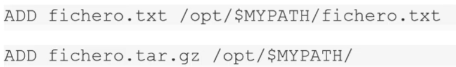
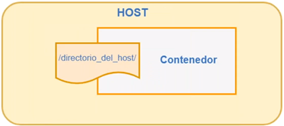

# Curso Docker - KeepCoding

## 0. Inicio

## 1. Introducción

### 1.1 Introducción a Contenedores y Docker
- Industria software ha cambiado:
- Antes
    - App monolíticas.
    - Largos ciclos de desarrollo.
    - Entorno único.
    - Escalado lentamente.
- Ahora
    - Servicios desacoplados.
    - Mejoras rápidas e iterativas.
    - Múltiples entornos.
    - Escalar rápidamente.
- Implementación se vuelve muy compleja
- Muchos conocimientos diferentes
    - Lenguajes
    - Frameworks
    - BBDD
- Muchos entornos diferentes
    - Entornos de desarrollo individual.
    - Preproducción, QA, integración, etc.
    - Producción: cloud e hybrid.
- Docker es una herramienta de código abierto.
- Dos versiones: Community Edition (+ usada) y Enterprise Edition (+ estable y con soporte).
- Paquetizar todas las aplicaciones y poder usarlas en cualquier SO.
- Permite ensamblar apps rápidas y elimina problemas que pueden ocurrir al enviar el código pudiendo subir a producción de manera más rápida y eficaz.

### 1.2 Características
- **Ligero**: los contenedores de una máquina comparten el mismo Kernel. Esto no ocurre con las MVs.
- **Portable**: el proceso que se arranca con el sistema de ficheros lleva todas las dependencias para que la aplicación funcione en cualquier máquina a la que se porte.
- **Inmutable**: si funciona en el equipo de desarrollo, funcionará en todos los equipos donde se ejecute.
- Docker trabaja con un lema: **Build, ship and run any app, anywhere**. (Generar los contenedores, transportarlos y ejecutarlos)
- ¿Qué aporta?
    - Escalabilidad: horizontal (añadiendo nodos como sean necesarios) y vertical (portando el contenedor a una máquina con + recursos). 
    - Portabilidad

### 1.3 Componentes de Docker
- Arquitectura muy modular: muchos componentes, algunos de muy alto nivel, que permiten personalizar bastante Docker.
- Componentes principales:
    - **Cliente**
        - El usuario interactúa con el demonio por medio del cliente.
        - Suele utilizarse la línea de comandos.
        - Tiene API. Permite escribir programas que interactúen directamente con el demonio sin usar el cliente.
        - Se usa para hablar con el dominio a través del protocolo HTTP.
    - **Demonio**
        - Proceso principal de gestión del _engine_. 
        - Corre en la misma máquina anfitriona. No siempre tiene que estar instalado en la máquina, y como cliente nos podemos conectar al demonio y lanzar instrucciones. - Responsable de crear, ejecutar y monitorizar los contenedores. También de construir y almacenar las imágenes. 
        - Todas las instrucciones se lanzan contra este.
        - Acepta peticiones y crea imágenes.
    - **Registry**
        - Almacenan y distribuyen imágenes.
        - Predeterminado: Docker Hub. 


### 1.4 Concepto de contenedores
- **Contenedores**
    - Proceso aislado al resto de procesos del sistema. 
    - Paquete que contiene una app y todo el software necesario para que se ejecute.
    - Teniendo instalado Docker Engine se pueden ejecutar tantos contenedores como se desee.
    - Es ejecutado por el kernel del host, como una app más pero de forma aislada del resto ya que tiene su propio sistema de ficheros.
    - Dispone de su propio espacio de usuario (atributos, ids, grupos, etc).
    - Dispone de su propio espacio de procesos: provee opción de suspensión y recuperación de procesos en la misma máquina o al migrarse.
    - Se pueden compartir espacio de ficheros con la máquina host, o espacio de usuarios y procesos con otros contenedores.


### 1.5 Diferencia entre contenedores y máquinas virtuales
- Virtualización
    - Máquina virtual: virtualización del entorno de ejecución para ejecutar aplicaciones.
    - Virtualización del hardware
- El contenedor tiene lo esencial para ejecutar la aplicación. 
- Una MV tiene todo el SO y dentro de este se pueden instalar diferentes servicios, con el consiguiente consumo que supone.
- Entorno virtualizado
    - Varios SOs.
    - SO invitado. Es el que se ejecuta sobre el HW virtualizado. 
    - Ventajas
        - Ejecución de un SO diferente al instalado.
        - Posibilidad de clonar y mover la MV de un ordenador físico a otro.
        - Aprovechamiento de recursos con varios _guests_ en un mismo host.
    - Inconvenientes
        - Rendimiento.
        - Nº de sistemas corriendo en la misma máquina.


### 1.6 ¿Por qué son tan eficientes los contenedores?
- Un contenedor no necesita hipervisor.
- Un contenedor es un paquete. Contiene una aplicación y todo el sw necesario para ejecutarlo.
- El contenedor se ejecuta directamente por el kernel del host.

## 2. Instalación

### 2.1 Docker en los distintos sistemas operativos


### 2.2 Instalar Docker en Linux
- Guía de instalación: https://docs.docker.com/install/
- Máquina virtual
    - **Usuario**: Ubuntu_1804
    - **Contraseña:** password
- Instalación (seguir web)
```bash
sudo apt-get update
sudo apt-get install \
    apt-transport-https \
    ca-certificates \
    curl \
    gnupg-agent \
    software-properties-common
curl -fsSL https://download.docker.com/linux/ubuntu/gpg | sudo apt-key add -
sudo apt-key fingerprint 0EBFCD88
sudo add-apt-repository \
   "deb [arch=amd64] https://download.docker.com/linux/ubuntu \
   $(lsb_release -cs) \
   stable"
sudo apt-get update
sudo apt-get install docker-ce
```

- Probar funcionamiento
    - **Run** ejecuta el contenedor listado a continuación del comando.
```bash
sudo docker run hello-world
```

- Añadir al usuario para que no utilice sudo
```bash
sudo groupadd docker
sudo usermod -aG docker $USER
```
### 2.3 Primer Contenedor
```bash
docker run hello-world
```

## 3. Empezando con Docker

### 3.1 Comandos Docker
- Docker asigna nombres aleatorios a los contenedores (si no le asignados uno antes).
- Ayuda
    - Están agrupados por funcionalidades.
```bash
$ docker help
$ docker COMMAND --help
$ docker container --help
$ docker container ls
$ docker container ls --help
$ docker rm zealous_golick
$ docker image --help
$ docker image ls -a
$ docker image rm hello-world -f
$ docker version
$ docker search ubuntu
```

### 3.2 Imágenes y contenedores
- **Imagen**
    - Conjunto de ficheros que contiene todos los elementos necesarios para que la imagen pueda ser ejecutada.
    - NO tienen estado.
    - NUNCA cambian, son fijas, siempre. NO se pueden modificar.
    - Cada vez que se ejecuta un **docker run** de una imagen, se genera un nuevo contenedor.
    - Se pueden ejecutar varios contenedores de la misma imagen.
    - "Plantilla base"
- **Contenedor**
    - Instancia en ejecución de una imagen.
    - SI tiene estados (arrancado, pausado, detenido o terminado) y se puede modificar (añadir ficheros, por ej).
    - Se puede modificar su contenido e información estando en ejecución.
    - "Ejecución de la plantilla".
- **Comandos**
    - Imágenes
        - **Pull**: bajar la imagen.
        - **Push**: se genera imagen y se sube.
        - **Build**: crear imágenes.
        - **Save**: guardar imagen.
        - **Load**: cargar imagen guardada.
    - Contenedores
        - **Run**
        - **Stop**
        - **Start**
        - **Restart**
        - **Inspect**
        - **Stats**


### 3.3 Docker Store - Docker Hub
- Las imágenes se descargan de:
    - Docker Store
    - Docker Hub

```bash
# Descarga una versión específica de Ubuntu
$ docker pull ubuntu:16.04 
```

### 3.4 Comandos para contenedores
```bash
$ docker ps -a # Se está deprecando, mejor usar ls

# Lista de directorio raíz todos los ficheros y directorios.
$ docker container run ubuntu ls -ltr 

# Lo mismo que el anterior, pero de la versión anterior de Ubuntu.
$ docker container run ubuntu:16.04 ls -ltr

# Cambiar nombre (NAMES) por el que se escoja
$ docker container run --name miubuntu ubuntu:16.04 ls -ltr

# Ejecutar contenedor y dejarlo arrancado
$ docker container run --name ultimoubuntu ubuntu top -b

# Detener el contenedor que se está ejecutando
$ docker container stop 1506bd3b402b

# Ejecutar contenedor y dejarlo arrancado en segundo plano (detach)
$ docker container run -d --name ubu ubuntu top -b

# Arranca una máquina con la que se puede ejecutar comandos en Bash
$ docker container run -it ubuntu:16.04 bash

# Ver logs que genera el contenedor
## Muestra los logs hasta el momento de ejecutar el comando
$ docker container logs --details 09af5050365f
## Muestra los logs en tiempo real (follow)
$ docker container logs -f 09af5050365f

# Detalles del contenedor
$ docker inspect nombreContenedor 

## Ir a una propiedad en concreto
$ docker inspect --format='{{.Name}}' infallible_rubin
$ docker inspect --format='{{.NetworkSettings.SandboxKey}}' infallible_rubin

# Se para, pero no se borra
# Se pueden parar varios a la vez
$ docker stop <contenedor>

# Arranca un contenedor parado
$ docker start <contenedor>

# Lista todos los IDs de los contenedores y los borra
#  -q, --quiet           Only display numeric IDs
$ docker container stop `docker container ls -q`
$ docker container stop $(docker container ls -q)

# Borra un contenedor (o varios)
#   -f  Borra un contenedor aunque no esté parado
#   -v  Borra el contenedor y sus volúmenes
$ docker container rm <contenedor>
$ docker container rm `docker container ls -qa`
$ docker container rm $(docker container ls -qa)

# Ejecuta comandos dentro del contenedor
$ docker exec <contenedor> ls -ltr

# Activa shell dentro del contenedor y es como si estuvieras dentro de él. 
# Se podrán ejecutar comandos dentro de este.
#   -i, --interactive   Keep STDIN open even if not attached
#   -t, --tty           Allocate a pseudo-TTY
# Utilizando "exit" se mantiene la sesión corriendo
# 
$ docker exec -it <contenedor> sh 

# Copiar ficheros del contenedor local
$ docker cp <contenedor>:/sbin/tune2fs ./

# Estadísticas
$ docker stats <contenedor>
```
**Contenedor arrancado** 


**Contenedor detenido**


```bash
# Borra contenedores parados, imágenes y volúmenes que no se utilizan.
# NO USAR EN PRODUCCIÓN
$ docker system prune
```

### 3.5 Empezando con Docker - Ejercicio 1
1. Descargar imagen de Nginx en su última versión.
2. Ejecutar el contenedor en *segundo plano* para poder acceder al servidor por el puerto 80 en el navegador.
3. Acceder desde un navegador a http://localhost
4. Ejecutar otro contenedor para poder acceder por el puerto **8081** en el navegador.
5. Listar los contenedores activos.

**Respuesta**
```bash
# 1
$ docker container pull nginx

# 2
# -p80:80 significa que el puerto 80 de docker (segundo valor) se expone en el puerto 80 (primer valor) del anfitrión.
$ docker run -d -p80:80 --name nginx80 nginx
$ docker run -d -p8085:80 --name nginx80 nginx

# Cambiar el fichero default
$ docker cp /home/ubuntu/index.html nginx80:/usr/share/nginx/html/index2.html

# 4
$ docker run -d -p8081:80 --name nginx8081 nginx

# 5
$ docker container list
```

### 3.6 Resumen
- Imagen Alpine
    - Basada en Alpine Linux.

```bash
$ docker container run alpine echo "Hola mundo!"

# Múltiples utilidades de poco peso
$ docker container run busybox ls -l
```

### 3.7 Comandos para imágenes
```bash
# Listado de imágenes
#   -q      Devuelve únicamente los IDs de todas las imágenes.
$ docker images

# Ayuda para salvar imágenes
$ docker image save --help
$ docker image save --output <fichero> <imagen:label>
$ docker image save --output fichero_imagen_alpine alpine
# Guarda la imagen comprimida en .tar
$ docker image save  alpine > miAlpine.tar

# Elimina imagen
#   -f      Fuerza eliminación
$ docker image rm <imagen:label>
# Elimina TODAS las imágenes descargadas.
$ docker image rm `docker image ls -q` 

# Carga imagen
#   -i      Carga imágenes comprimidas en .tar
$ docker image load --help
$ docker image load <fichero>
# Carga una imagen comprimida en .tar
$ docker image load -i miAlpine.tar
```

### 3.8 Empezando con Docker - Ejercicio 2
1. Ejecuta el contenedor de la última versión de la imagen busybox asignando el nombre "muBusyBox" al contenedor creado en modo shell.
2. Listar todos los contenedores activos.
3. Mostrar estadísticas del contenedor myBusyBox.
4. Hacer copia de un fichero a local.
5. Guardar la imagen en un fichero con nombre **imagen_busybox.tar** para poder transportarla.
6. Borrar la imagen descargada.
7. Obtener la IP asignada al contenedor.

**Respuesta**
```bash
# 1
$ docker pull busybox
$ docker run --name myBusyBox -it busybox sh
# ctrl + p + q 

# 2
$ docker ps
$ docker container attach myBusyBox

# 3
$ docker stats myBusyBox

# 4
$ docker container cp myBusyBox:/etc/hosts ~/

# 5
$ docker image save busybox > ~/imagen_busybox.tar

# 6
$ docker container rm `docker container ls -qa`
$ docker image rm busybox

# 7
$ docker inspect myBusyBox
$ docker inspect --format='{{.NetworkSettings.IPAddress}}' myBusyBox

# Alternativa si está arrancada
$ docker pull busybox
$ docker run --name myBusyBox busybox ifconfig # 172.17.0.2

```

### 3.9 Empezando con Docker - Ejercicio 3
1. De la carpeta /examples/3.EmpezandoConDocker/ cargar las imágenes imagen1.tar.gz e imagen2.tar.gz
2. Obtener el nombre y la versión de cada una de las imágenes.
3. Arrancar en modo *detach* la imagen 2 y ver los logs que va generando.
4. Parar el contenedor de la imagen 2.

**Respuesta**
```bash
# 1
$ gzip -d imagen.tar.gz # Opcional, se puede cargar con el tar.gz
$ docker image load -i imagen.tar #.gz
$ gzip -d image2.tar.gz # Opcional, se puede cargar con el tar.gz
$ docker image load -i imagen2.tar #.gz

# 2
$ docker image inspect --format='{{.RepoTags}},{{.DockerVersion}}' alpine
$ docker image inspect --format='{{.RepoTags}},{{.DockerVersion}}' mongo:4.1

# 3
$ docker container run -d mongo:4.1
$ docker container logs -f f4769a9d1f2d
$ docker container logs --details f4769a9d1f2d

# 4
$ docker container stop f4769a9d1f2d
```

## 4. Creación de imágenes

### 4.1 Arquitectura de imágenes
- Cada imagen está compuesta por una capas.
- Cada capa representa un cambio importante dentro del sistema de ficheros del contenedor.
- Se pueden compartir entre distintas imágenes.
- Una imagen es una especia de snaptshop/captura creado a partir de distintas capas.
- Las imágenes se basan en un sistema de archivos de capas que ofrecen ventajas y beneficios: ligeros, compartir partes comunes que muchos contenedores pueden desplegar y ejecutar en la misma máquina.
- **NO** se pueden modificar las capas de una imagen. Solo se pueden ver.
    - El contenedor de esa imagen es quien crea la capa superior, se superpone sobre la capa de la imagen y sobre esta **si** se tendrán permisos de escritura.
- Docker gestiona todo el tema de las capas mediante un **storage driver**. 
    - Controlador de almacenamiento de Docker que maneja los detalles sobre la forma en que están estas capas e interactúan entre si. 
    - Hay diferentes tipos de controladores disponibles: Overlay2 (default), Auxs, etc.
- Varios contenedores pueden compartir el acceso a la misma imagen, pero tener su propio estado independiente. 


### 4.2 Crear la primera imagen
- **Contexto**: directorio de donde se coge toda la información (ficheros de configuración, los que se quieren añadir a la imagen, etc.)
- Directorio raíz
    - Carpetas y ficheros
    - Dockerfile
    - .dockerignore

```bash
$ docker image build [-t <tag>] <contexto>
```

### 4.3 Qué es Dockerfile?
- Archivo de texto plano que contienes las instrucciones; pasos que se han de ejecutar para que la imagen funcione correctamente.
- Instrucciones necesarias para automatizar la creación de una imagen que se usará posteriormente para la ejecución de instancias específicas.
- Instrucciones que se le pasan
    - A partir de qué imagen (Ubuntu, Alpine, Busybox, etc) se va a crear la imagen.
    - Comando para ejecutar en la imagen: teniendo la imagen base, se añadirán nuevas capas con instrucciones que se vayan generando.
    - Archivos para incluir en la carpeta del proyecto. 
    - Dependencias y/o programas.
    - Puertos abiertos.
    - Comandos para ejecutar cuando se inicia la imagen.
- El ID que se le asigna a la última capa va a ser el ID de la imagen general.
- El **ENTRYPOINT** es lo que se ejecuta al lanzar la imagen.
- El comando **docker image history** muestra el histórico de una imagen (las capas que componen una imagen).

```bash
$ cd Imagen1
$ cat Dockerfile 
#Establecemos imagen base
FROM ubuntu:18.04 # Imagen de la que se parte para crear la nueva
#Comando para indicar al contenedor que comando ejecutar cuando arranque
ENTRYPOINT echo "Hola Mundo desde imagen de Docker"

$ docker image build -t holamundo_ubuntu .
```


### 4.4 Instrucciones en Dockerfile

- Instrucciones
    - FROM
    - **CMD**: especifica el comando a ejecutar cuando se inicia el contenedor. Se puede inhabilitar las opciones dadas al ejecutar **docker run**.
    - **ADD**: permite añadir ficheros.
    - **COPY**: permite copiar ficheros.
    - VOLUME
    - **WORKDIR**: posicionarse dentro de un directorio donde se ejecutarán comandos cuando se genera la imagen. Es similar a un *change directory*.
        - Se puede reemplazar el directorio de trabajo en tiempo de ejecución con el parámetro **-w**.
    - USER
    - **LABEL**: sirve para etiquetar las imágenes.
    - STOPSIGNAL
    - ARG
    - **ENV**: variables de entorno.
    - **RUN**: ejecuta los comandos en la capa superior, generará una nueva capa. Es mejor ejecutar todos los runs de una para no crear nuevas capas por cada ejecución.
    - ONBUILD
    - **EXPOSE**: expone puertos de cara a la máquina local poder hacer uso de estos.
    - **ENTRYPOINT**: comando a ejecutar cuando se arranque el contenedor.

- [Dockerfile best practices](https://docs.docker.com/develop/develop-images/dockerfile_best-practices/)





### 4.4 Ejercicio


**Solución**
```bash
$ cat Dockerfile 
FROM ubuntu:18.04
LABEL author="Jask" version="0.1" description="Primer ejercicio"

COPY carpeta examples
COPY fichero.txt examples/

$ cat .dockerignore 
carpeta/carpeta2
carpeta/*.png

$ docker image build -t ejercicio1 .
$ docker container run -ti ejercicio1 bash
```

### 4.5 Subir y descargar imágenes en Docker Hub

- Hay un sistema jerárquico para almacenar imágenes
    - [Registro](https://hub.docker.com/)
    - Repositorio
    - Imagen
    - Etiqueta
```bash
# Conexión a DockerHub
$ docker login

# Etiqueta imagen para subirla
$ docker tag <nombre-imagen> <id-usuario>/<nombre-imagen>

# Subir imagen
$ docker push <id-usuario>/<nombre-imagen>

# Descargar imagen
$ docker pull <id-usuario>/<nombre-imagen>
```

### 4.6 Caché de Docker

- La caché afecta a operaciones de **build**, **pull** y **push**.
- En la creación de imágenes, Docker ejecuta las intrucciones en el Dockerfile y busca cada capa en caché (si existe) para ver si la puede reutilizar. 
    - Para instrucciones ADD y COPY, el contenido del archivo es examinado (checksum).
    - Si hay modificación en esos ficheros se vuelven a comprobar y añadir.
    - Estas compilaciones se crean y destruyen en el disco, por eso es importante la caché.
- Si los objetos en el sistema de archivos no cambian entre compilaciones, la caché ahorra tiempo. 
    - Esto hace que construir un nuevo contenedor sea bastante rápido. 
    - No se tienen que crear ni destruir ninguna estructura de archivos ya que no ha habido modificación.
- No siempre se requiere usar la caché
    - **-no-cache** al crear la imagen, hacer un **push** o **pull**.


### 4.7 Buenas prácticas (Dockerfile)

1. Optimizar instrucciones
    - Usar el menor número posible.
    - Encadenar comandos en la misma instrucción.
2. NO instalar paquetes innecesarios.
3. Ordenar argumentos de varias líneas.
4. Minimizar el contenido a lo estrictamente necesario. Utilizar Dockerignore.
5. Un solo proceso por contenedor.


## 5. Manejando volúmenes

### 5.1 Introducción
- Permite compartir ficheros entre host-contenedor o contenedor-contenedor.
- Usa espacio en el equipo local: **/var/lib/docker/volumes**.
    - Se podrán seguir accediendo a los ficheros a pesar de que el contenedor esté parado.
- Características de los volúmenes
    - **Independiente de las imágenes**: solo se crean cuando se crea un contenedor. Cuando se monta una imagen **no** se especifica el volumen al crear, solo cuando se crean los contenedores.
    - **Reutilizados**: lo pueden usar varios contenedores.
    - **Modificaciones visibles**: los cambios se ven de manera automática en todos los contenedores.
    - **Información persistente**: no se elimina al eliminar el contenedor.
    - **Rendimiento**: mejora el I/O al disco local, más rápido manejando ficheros. 

### 5.2 Tipos de Volúmenes
- **Volúmenes de datos**: disco que se acopla dentro de un contenedor. Se crea un contenedor con un volumen y ese mismo contenedor se va a utilizar cuando se arranque otro contenedor para almacenar datos.
- **Volúmenes de host**: directorio de la máquina compartido con el contenedor.
- [**Más info**](https://dockertips.com/volumenes)

### 5.3 Trabajando con Volúmenes
```bash
# Volúmenes de datos
$ docker run -v /directorio contenedor:versión
# Se crea el volumen de un contenedor
$ docker container run -v /logs --name volumen_logs busybox 
# Se usa el volumen creado anteriormente para un nuevo contenedor
$ docker container run -it --name myApp1 --volumes-from volumen_logs ubuntu_vim bash

# Volúmenes de host
$ docker run -v ~/directorio_local:/directorio_contenedor contenedor:versión
$ docker run --name ubuntu_vol1 -v ~/Documents/DockerCourse/Volumen1:/ejemplos -it ubuntu_vim bash

# Comprobar configuración de volúmenes
$ docker inspect <volúmen>
```




## 6. Aplicaciones multicontenedor - Docker compose

### 6.1 ¿Qué es Docker Compose?
- Herramienta para definir y correr aplicaciones multi contenedores.
- Bueno para integración continua.
- Archivo de Compose.
    - Los **contenedores** se denominan **servicios**.

### 6.2 Instalando Docker Compose
- [Instalación](https://github.com/docker/compose/install/)

```bash
$ sudo curl -L "https://github.com/docker/compose/releases/download/1.25.3/docker-compose-$(uname -s)-$(uname -m)" -o /usr/local/bin/docker-compose

$ sudo chmod +x /usr/local/bin/docker-compose

$ docker-compose --version
```

### 6.3 Creando fichero Compose
- Preparando el fichero de despliegue
    - Fichero con extensión **.yml**: **docker-compose.yml**
    - **version**: tener en cuenta este parámetro ya que siempre tiene que ir la última.
    - **depends_on:** depende de otro servicio. Primero se levanta el servicio del que depende y luego él mismo.
    - **links**: relación entre servicios.
    - **restart**: política que se aplica cuando hay algún fallo en el contenedor.


### 6.4 Comandos Compose
- Comandos
    - docker-compose <comando> <servicio/s>
    - **up**: realiza el "build" **solo** la primera vez, y crea las imágenes. 
        - Para hacer el **build** se debe forzar utilizando el comando **--build**.
        - $ docker-compose up --help
    - pull
    - build
    - push
    - run
    - rm
- [Más info](https://www.thegeekstuff.com/2016/04/docker-compose-up-stop-rm/)

### 6.5 Ejemplo Docker Compose
```bash
# Dentro de la carpeta del Docker Compose
#   --build: vuelve a ejecutar todo el proceso aunque ya se haya ejecutado anteriormente.
$ docker-compose up -d [ --build ]

# Ver servicios arrancados
$ docker-compose ps

# Ver las imágenes definidas
$ docker-compose images
```

### 6.6 Ejercicio
- Fichero compose con dos servicios que se reinicien siempre.
    - DB
        - MySQL 5.7
        - Volumen /var/lib/mysql (host-container)
    - Wordpress
        - Depende de DB
        - 8000:80

- Resolución
```bash
$ cat docker-compose.yml
version: '3.3'
services:
    db:
        image: 'mysql:5.7'
        volumes:
            - 'db_data:/var/lib/mysql'
        environment:
            MYSQL_ROOT_PASSWORD: somewordpress
            MYSQL_DATABASE: wordpress
            MYSQL_USER: wordpress
            MYSQL_PASSWORD: w0rdpr45!
        restart: always
    wordpress:
        image: 'wordpress:latest'
        depends_on:
            - db
        ports:
            - '8000:80'
        restart: always
        environment:
            WORDPRESS_DB_HOST: 'db:3306'
            WORDPRESS_DB_USER: wordpress
            WORDPRESS_DB_PASSWORD: w0rdpr45!
volumes:
    db_data:
```

## 7. Docker Registry

### 7.1 Introducción
- Permite almacenar y distribuir imágenes propias. 
- Docker Hub sería un registry.
    - Posix Local
    - S3
    - Azure
    - OpenStack Swift
    - Google Cloud Storage
- Imagen de contenedor
    - **docker -d -p 5000: 5000 registr:2**


### 7.2 Instalación
- Configuración
    - Almacenamiento
        - **docker -d -p 5000: 5000 -v /dir/registry:/var/lib/registry registry:2**
    - Seguridad
        - TLS

```bash
# Primer registry
#   No hace falta crear la carpeta "registro", la crea en el build.
$ cat docker-compose_first.yml 
version: "3.2"
services:
  registry:
    restart: always
    image: registry:2
    ports: 
      - 5007:5000
    volumes:
      - ./registro:/var/lib/registry
  web:
    restart: always
    image: konradkleine/docker-registry-frontend:v2
    ports: 
      - 8082:80
    environment:
      - ENV_DOCKER_REGISTRY_HOST=<IP-LOCAL> \
      - ENV_DOCKER_REGISTRY_PORT=5007


$ docker-compose up -d

$ docker info 
Insecure Registries:
  127.0.0.0/8 # Aquí DEBE aparece la IP local de la máquina.

# Modificar fichero para añadir la IP
$ sudo vim /etc/docker/daemon.json
{
    "insecure-registries":["192.168.186.128:5007"] # IP local + puerto
}

# Reiniciar servicio de docker
$ sudo systemctl restart docker

# Renombar imagen como en Docker Hub pero en este caso con IP+Puerto
$ docker image tag busybox 192.168.186.128:5007/busybox

# Subir imagen
$ docker push 192.168.186.128:5007/busybox

# Ver imágenes subidas
$ ls -l registro/docker/registry/v2/repositories/
http://192.168.186.128:8082/
```

## 8. Trabajando con Docker en entornos de desarrollo

### 8.1 Microservicios
- Enfoque para desarrollar aplicaciones con una serie de pequeños servicios, cada uno ejecutándose de forma autónoma y comunicándose entre sí a través de peticiones HTTP a sus APIs.
- Hay un número mínimo de servicios que gestionan cosas comunes para los demás, como el acceso a la BD.
- Cada uno es independiente, y el código debe ser desplegado sin afectar a los demás. Pueden ser lenguajes diferentes.
- Deben funcionar de forma independiente.
- "Se considera microservicio si el código se puede escribir en 2 semanas" (NO es una regla).
- Interfaz monolítica
    - Si se realiza un cambio en el Módulo 1, se debe subir toda la aplicación a producción ya que es un paquete, un conjunto.
- Pros
    - Pequeños: cada componente es un ejecutable por si mismo y se comunican entre si mediante llamadas.
    - Independientes: cada uno se puede desplegar de forma independiente sin afectar al otro.
    - Despliegue sencillo
    - Facilita la gestión de equipos: funcionales y autónomos: BD, Backend, etc.
    - Escalabilidad: más fácil de escalar a nivel de SW. Se replican los microservicios que tengan una carga mayor.
    - Reutilizables
    - Externalización
- Contras
    - Introducen complejidad que hay que aprender a gestionar
    - Gestión de trazas
    - Despliegues
- Antes de comenzar a desarrollar es conveniente estudiar si compensa tener una aplicación monolítica o con microservicios.
    


### 8.2 Docker en producción
- Ventajas
    - Imágenes inmutables y portables
    - Distribución
    - Combinar microservicios
- Retos de Docker en producción a mejorar
    - **Service discovery**: fáciles de localizar por los servicios que quieren interactuar con estos y también sus credenciales de acceso y/o uso.
    - **Balanceo de carga**: mismo microservicio en varios contenedores, debe haber un end-point que balancee las peticiones entre distintos contenedores.
    - **Configuración de red**: algunos servicios en redes diferentes solo pueden ser contantado por un sub-conjunto de microservicios. El problema se solventaría con la gestión de redes y sub-redes. De esta forma distintos servicios no se podrían ver entre ellos (de no ser necesario).
    - **Persistencia**
    - **Escalabilidad**
    - **Loggin y monitorización**
    - **Respuesta a fallos**: monitorizar y despliegue si hay fallos.
- ¿Qué es y por qué necesitaríamos de un orquestador?
    - Fueron desarrollados para gestionar de forma sencilla la creación, distribución y ejecución de contenedores a través de una gran infraestructura distribuida. Controla y dirige cada aspecto del sistema: creación, verificación, comprobación de errores etc. Si hay muchos desplegados es inviable mantenerlos manualmente.
    - ¿Cuáles hay?
        - Swarm
            - Oficial de Docker. Soportado por AWS.
            - Arquitectura controlador y nodos.
            - Defecto
                - No existe control sobre fallo de los nodos.
                - Peligroso para servicios de alta disponibilidad.
        - Mesos
            - Ofrece un kernel para cluster que corran en cada nodo y ofrecen plataformas como Hadop.
            - Tolerante a fallos.
        - Kubernetes
            - Automatiza el despliegue a través del datacenter.
            - Gestiona PODs (uno o más contenedores que forman un servicio y permite interconectar diferentes PODs).
    - ¿Mejor?
        - El más usado es Kubernete (y + complejo que los demás).
        - Swarm solo gestiona contenedores Docker. Kunernetes y Mesos soportan varios tipos de contenedores.

### 8.3 Docker en cluster - Docker Swarm

- Permite gestionar un grupo de hosts de Docker como un único host de docker virtual.
- Swarm utiliza la API estándar de Docker. Cualquier herramienta que se comunique con el Docker Daemon puede usar Docker Swarm.
- Para desplegar una imagen de una aplicación hay que crear un servicio.
- Su API es compatible con Docker Engine.
- Desde la versión 12 se puede utilizar el "swarm mode".
- Cuando haya un servicio se definirá su estado óptimo (recursos de red, almacenamiento, puertos expuestos, etc.). Docker trabaja para mantener el estado deseado.
- Si un nodo worker (los que ejecutan las tareas dentro de los contenedores) deja de estar disponible, Docker va a programar las tareas de ese nodo (contenedor en ejecución) en otro nodo.
    - Tarea: contenedor en ejecución que forma parte de un servicio dentro del cluster y está administrado por un manager que realiza tareas de administrador sobre las tareas que se van ejecutando.
- Ventaja de Swarm sobre los contenedores: puede modificar la configuración de un servicio. Cuida las redes y los volúmenes a los que está conectado sin la necesidad de reiniciar manualmente el servicio.
- Cuando Docker se ejecuta en modo Swarm **puede** ejecutar contenedores independientes.
- Diferencia entre contenedores independientes y servicios: solo los admins de estos servicios podrán gestionarlo. En cambio, los contenedores independientes se pueden ejecutar en cualquier nodo/hilo asignado al clúster. 
- Características
    - **Administración de clúster integrada**: no se necesita un sw de orquestación adicional para administrar el clúster.
    - **Diseño descentralizado**: Docker maneja cualquier especialización en tiempo de ejecución (administrador o manager, trabajadores o workers). Se puede construir un clúster completo desde una sola imagen de disco.
    - **Modelo de servicio declarativo**: puede escribir una aplicación compuesta con un servicio de FE web con un servicio de cola de BE con BBDD. 
    - **Escalado**
    - **Conciliación del estado deseado**: el nodo de admin de Swarm monitoriza constantemente el clúster y reconcilia cualquier diferencia entre el estado real y su estado deseado. Por ejemplo, si se configura un servicio para ejecutar 10 réplicas de un contenedor y una de estas réplicas se bloquea, el admin de clúster va a crear réplicas nuevas para reemplazar las que fallan. 
    - **Red multi-host**: se podrá definir una red de superposición para los contenidos.
    - **Detección de servicios**: los nodos administrador van a asignar a cada servicio un nombre DNS único. Se consulta a través de un servidor DNS incrustado.
    - **Equilibrio de carga**: se pueden exponer los puertos para los servicios y balancear las cargas.
    - **Actualizaciones continuas**.
- Componentes y propiedades de Swarm
    - **Nodos**: instancia del motor del Docker que participa en el clúster. Puede ejecutar uno o más nodos en una sola computadora física o nube pero su implementación de producción suele incluir nodos Docker distribuidos en múltiples máquinas físicas.
    - **Servicios y tareas**: estructura central del sistema. Raíz principal de la integración del usuario con el clúster.
    - **Balanceo de carga**: al admin de Swarm se encarga de exponer los servicios que desea que estén disponibles para el clúster. Si X contenedores ejecutan la misma tarea, el manager irá redirigiendo sobre estas tareas según la carga de trabajo que haya.
- Manager - Nodos
    - Se define un manager con tres workers. El manager, por defecto, se puede comportar como worker. 
    - Cada worker ejecuta una tarea dentro de un contenedor. 
    - Los nodos manager son los encargados de gestionar el clúster. 
        - Al desplegar una aplicación se le indica la definición del servicio en un manager node.
        - El manager node se encargará de las tareas que se ejecutan dentro de los workers.
        - También ejecuta las tareas destinadas a mantener el clúster y el estado de salud de los servicios.
        - Puede haber varios nodos manager en un clúster. Siempre se elige un líder que es el encargado de las tareas de orquestación.
    - Los workers son instancias de Docker Engine cuyo propósito es ejecutar contenedores. Reciben y ejecutan las tareas indicadas por los nodos manager, y ejecutan un agente que informa al manager de las tareas que se les han asignado.
- Servicios y tareas
    - Servicio
        - Definición de las tareas que se ejecutan dentro de un worker node. 
        - Objeto principal de la estructura que se define en un sistema Swarm.
        - Cuando se crea se indica qué imagen del contenedor se va a usar y qué comandos se van a ejecutar dentro del contenedor.
        - Los manager asignan tareas a los node workers de acuerdo al número de réplicas definidas por el servicio.
        - Cuando se crea el servicio se le puede asignar un número de réplicas, se crearán tantas tareas como réplicas que serán almacenadas en los contenedores de los workers que tengan asignado ese clúster.
    - Tipos de servicios
        - Implementaciones replicadas
            - Swarm va a crear una tarea por cada réplica que se le indique, para después distribuirlas dentro del clúster.
            - Ejemplo: servicio con 3 réplicas, Swarm creará 3 tareas.
        - Implementaciones globales
            - Servicio que se ejecuta la tarea en cada nodo.
            - Cada vez que se añade un nuevo nodo al clúster, el orquestador va a crear una nueva tarea y el programador va a asignar la nueva tarea al nodo.
- Balanceo
    - Cuenta con un sistema para balancear la carga dentro de su propio núcleo.
    - Cada nodo cuenta con el sistema pertinente para distribuir las peticiones.
    - Los manager pueden publicar automáticamente un puerto generado al azar, entre el 30.000 y el 32.000 por cada servicio. También se puede publicar uno específico.
    - Un sistema externo al clúster puede acceder al servicio en el puerto publicado a través de cualquier nodo de este, independientemente de que el nodo esté ejecutando una tarea del servicio o no.
    - Swarm cuenta con un DNS interno que asigna automáticamente una entrada a cada uno de los servicios desplegados dentro del clúster.


- Pasos para instalar Swarm en Ubuntu 18.04
    1. Establecer IPs fijas a cada máquina.
    2. Asignar nombre a cada máquina en el fichero **/etc/hosts**.
    3. Arrancar Swarm: **docker swarm init --advertise-addr \<IP-local\>**
        - Guardar y ejecutar la sentencia **docker swarm join** en cada nodo, así los workers se podrán unir al manager.
    4. **(Opcional)** Implementar interfaz web para poder visualizar todos los workers, tareas, etc.
        - Instalar Unzip si no lo está.
        - Descargar fichero del respositorio: **wget https://github.com/dockersamples/docker-swarm-visualizer/archive/master.zip** y extraerlo.
        - Mover directorio **docker-swarm-visualizer-master** debajo de la carpeta **examples**.
        - Ejecutar: 
        ```bash
        docker run -it -d -p 5010:8080 -v /var/run/docker.sock:/var/run/docker.sock dockersamples/visualizer
        ```
        - Abrir navegador web y entrar a la IP local de la máquina, al puerto 5010.
    5. Se crean servicios Nginx con 3 réplicas
        ```bash
        docker service create --name mi-web --publish 8080:80 nginx
        docker service scale mi-web=3
        ```
        - Comprobaciones por línea de comandos
            ```bash
            # Listado de los nodos
            docker node ls
            
            # Ver servicios
            docker service ls

            # Inspeccionar servicio
            docker service inspect --pretty <ID-Servicio>

            # Ver qué nodos asociados están ejecutando el servicio
            docker services ps <ID-Servicio>

            # Eliminar un servicio
            docker service rm <ID-Servicio>
            ```

### 8.4 Docker e integración continua
- ¿Qué es?
    - Práctica de desarrollo de software donde los miembros del equipo integran su trabajo frecuentemente, al menos una vez al día. Cada integración se verifica con un build automático (que incluye la ejecución de pruebas) para detectar errores de integración tan pronto como sea posible.
    - Mayor visibilidad al proceso.
    - Mejora la calidad del producto.
- Herramientas necesarias
    - Maven
    - Git o Clear Case
    - Jenkins o Hudson
    - SonarQube
    - Nexus
- Con Docker
    - Aplicaciones IC con imágenes.
    - Automatizar el build de imágenes.
    - Optimización de Docker Build.
    - Test de integración con Docker.
- Testeo de aplicaciones con Docker.
    - Ligero
    - Portable
    - Inmutable

```bash
$ cat docker-compose.yml
version: "3.2"
services:
  web:
    image: nginx
    build: .
    depends_on:
      - redis
    ports:
      - 5005:5000
  redis:
    image: redis
  test:
      build:
        context: .
        dockerfile: Dockerfile.test
      depends_on:
        - web
      command: sh /test_dir/test.sh

$ cat Dockerfile.test 
FROM alpine:3.6

RUN apk --no-cache add curl

WORKDIR /test_dir

ADD test.sh /test_dir/test.sh

$ cat test.sh 
#!/bin/bash
echo "Empezando test"
sleep 3
echo "Ejecutando test"
if curl <IP-LOCAL>:5005 | grep -q 'Detalles de visitas'; then
  echo "Tests passed!"
  exit 0
else
  echo "Tests failed!"
  exit 1
fi

# Elimina el contenedor después de correrlo (solo test)
#   Si hay algún problema al ejecutarlo, renombrar todo "test" a otro nombre de fichero.

# (OPCIONAL) Fuerza a que el fichero vuelva a pasar a la imagen y coja la modificación.
$ docker-compose up -d --build

$ docker-compose run --rm test

# Nombre de los servicios que se han creado (test o jask)
$ docker-compose ps --services
```

### 8.5 Seguridad en Docker
- Evitar ataques
    - Pérdida de disponibilidad, ataque DoS.
    - Pérdida de confidencialidad, ataque Software & crypto exploit.
    - Escalado de privilegios dentro del host, ataque Container scape.
    - Host comprometido, ataque root/kernel exploit.
- Seguridad dentro del host
    - Partición específica para Docker.
        - **/var/lib/Docker**
    - Firewall
    - Limitaciones por kernel de Linux.
    - Docker y sistema operativo actualizados.
- Servicio Docker
    - Definir políticas.
    - Gestión de logs: envío de los fuera del servidor.
    - Limitar qué usuarios pueden controlar el dominio de Docker.
- Limitación de recursos HW
- Seguridad en la creación de imágenes con dockerfile
    - Usuario creado en dockerfile
        - RUN useradd <opciones>
        - USER <usuario>
    - Priorizar uso de COPY por encima de ADD: ADD tiene vulnerabilidades potenciales. Permite descargar ficheros maliciosos de diferentes URLS que no han sido comprobadas, puede descomprimir, etc.
- Contenedores
    - Permisos restringidos.
    - Restricción de puertos: no permitir que los contenedores mapeen puertos privilegiados de la máquina host. Hay excepciones (80, 443).
    - Limitar recursos: los recursos se consumen de forma equitativa, es buena idea limitarlos.
- Análisis de vulnerabilidades
    - DockerHub tiene una funcionalidad para tal fin.

## 9. Kubernetes

### 9.1 Introducción
- Kubernete o K8s
- Orquestador de Kubernetes
    - Gestión
    - Despliegue
    - Escalabilidad
    - Monitorización
    - Se puede gestionar toda la infra desde las APIs.
- Plataforma de código abierto y proyecto muy vivo.
- Características
    - Distribución de contenedores.
    - Balanceo de carga.
    - Fácil gestión de servicios y aplicaciones.
    - Escalabilidad.
    - Alta disponibilidad.
    - Monitorización de contenedores.
    - Despliegue y retrocesos automáticos.
    - Muy modular y mucha flexibilidad.

### 9.2 Arquitectura
- Conceptos
    - **Cluster**: grupo de máquinas físicas y virtuales que son utilizadas por Kubernetes dónde se despliegan los PODs gestionados y replicados.
    - **Nodo**: máquina que se ejecuta en Kubernetes en las cuales se pueden programar los PODs.
    - **Pod**: unidad más pequeña desplegable que puede ser creada, programada y manejada por Kubernetes. Grupo de contenedores Docker de aplicaciones que comparten volúmenes y red y que deben ser desplegados y gestionados por el *Replication controller*.
    - **Replication controller**: maneja fallos y recrea, de ser necesario los PODs. Se asegura que el nodo de réplicas de PODs se esté ejecutando.
    - **Servicio**: abstracción, define un conjunto de PODs y lógica para acceder a estos. Un conjunto de PODs están destinados a un servicio. El conjunto de PODs está etiqueta por un servicio y determinado por un selector de *labels*. Bajo un nombre están asociados y un servicio va a poder ejecutarlos. Se consigue que si hay un cambio en un POD sea transparente para el usuario y el servicio. Los servicios ofrecen la capacidad de buscar y distribuir el tráfico, proporcionando un nombre y dirección o puerto persistente para los PODs con un conjunto común de *labels*.
    - **Labels**: pares clave/valor. Usados para agrupar, organizar y seleccionar un grupo de objetos como los PODs. Fundamentales para que los servicios y los *replications controlers* obtengan la lista de los servidores por donde el tráfico debe pasar.
- Trabaja con una arquitectura maestro-esclavo.
- Maestro
    - Ejecuta los procesos de Kubernetes: servico API, programador, scheduler, controlador de recursos principales.
    - Adminsitra el ciclo de vida del maestro cuando crea o elimina un cluster.
    - Administra recursos de red y almacenamiento para las cargas de trabajo.
- Nodos
    - Un cluster suele tener 1 o x nodos.
    - Máquinas que ejecutan todas las aplicaciones, el contenedor y otras cargas de trabajo.
    - Los nodos actúan como cliente del servidor.
    - Son gestionados desde el maestro. Le envían info al maestro.
- Componentes en nodo máster y esclavo
    - **Máster**
        - **Scheduler**
            - Distribuye los PODs entre los nodos. 
            - Lee los requisitos del POD, analiza el clúster y selecciona los nodos aceptables. 
            - Se comunica con el API server en busca de PODs no desplegadas para desplegarlos en el nodo que mejor satisface los requisitos. 
            - Es el responsable de monitorización la utilización de recursos de cada host para asegurar que los PODs no sobrepasen los recursos disponibles. 
        - **Kube-controller**
            - Servicio usado para manejar el proceso de replicación definido en las tareas de replicación asignadas. 
            - Detalles descritos en el ETCD, donde el controller manager va a observar los cambios. 
            - Cuando se detecta un cambio, va a leer la nueva información y ejecuta el proceso de replicación hasta alcanzar el estado deseado.
        - **Kube-apiserver**
            - Provee el API que controla la orquestación de Kubernetes. 
            - Responsable de mantenerla accesible. 
            - Expone interfaz REST que procesa operaciones como creación, configuración de PODs y servicios de actualización de los datos almacenados en ETCD y es responsable que los datos de ETCD y características de los servicios de los contenedores desplegados sean coherentes. 
            - Permite que distintas herramientas y librerías puedan comunicarse de una manera fácil y sencilla. 
        - **ETCD**
            - BBDD distribuida en múltiples nodos y almacena claves/valor donde Kubernetes va a ir guardando info (configuración y metadatos) acerca del mismo, PODs, servicios, redes, etc. para que puedan ser utilizadas por cualquier nodo del clúster. 
            - Coordina los componentes ante cambio de sus valores. 
            - Kubernetes utiliza ETCD para almacenar el estado del clúster.
    - **Esclavo**
        - **Podsdocker / Docker ORT** 
            - Se utiliza para correr las aplicaciones en un ambiente encapsulado. 
            - Motores de contenedores que funciona en cada nodo descargado y corre las imágenes.
        - **Kube-Proxy**
            - Proporciona servicio de proxy y de red. 
            - Se encarga de los servicios que se encuentran disponible para el exterior, balanceo de carga y enrutamiento de tráfico por dirección IP.
        - **cAdvisor**
            - Recurso diseñado para los contenedores Docker e integrado en Kubelet. 
            - Agente de uso de los recursos y análisis que descubre todos los contenedores en la máquina y recopila información sobre CPU, memoria, sistema de ficheros y estadísticas del uso de la API. 
            - Proporciona el uso general de la máquina mediante el análisis del contenedor principal de la máquina.  
        - **Kubelet**
            - Gestiona los PODs, contenedores, imágenes, volúmenes, etc. 
            - Cada nodo corre un Kubelet que es el responsa ble del registro de cada nodo y la gestión de los PODs corriendo en ese nodo. 
            - Pregunta al API server por PODs para ser creados y desplegados por schedulers, y por PODs para ser borrados basados en eventos de clúster. 
            - Gestiona y comunica la utilización de recursos, estado de los nodos, PODs corriendo.


### 9.3 Instalación
- Se puede ejecutar en varias plataformas.
- [Documentación - Instalación](https://kubernetes.io/docs/setup/production-environment/tools/kubeadm/install-kubeadm/)
- **Minikube**: opción de utilizar una versión mini de Kubernetes. Solo para pruebas de desarrollo. No es recomendable poner en producción.
- **Microk8s**: otra opción para ejecutar Kubernetes de forma local. No requiere máquina virtual. Se puede instalar en Ubuntu y consume menos recursos que si se levanta un clúster.

#### Pasos

1. Asignar IP estática a cada máquina.
2. Editar el fichero **/etc/hosts** en todas las máquinas y añadir registros manager01, worker01, etc.
3. Habilitar docker **sudo systemctl enable docker**.
4. Ejecutar:
```bash
$ sudo apt-get update && sudo apt-get install -y apt-transport-https curl
$ curl -s https://packages.cloud.google.com/apt/doc/apt-key.gpg | sudo apt-key add -
$ cat <<EOF | sudo tee /etc/apt/sources.list.d/kubernetes.list
deb https://apt.kubernetes.io/ kubernetes-xenial main
EOF
$ sudo apt-get update
$ sudo apt-get install -y kubelet kubeadm kubectl
$ sudo apt-mark hold kubelet kubeadm kubectl

# Deshabilitar el swap-memory ya que Kubernetes no funciona con la memoria de intercambio
$ sudo swapoff -a

# Cambiar hostname
$ sudo hostnamectl set-hostname manager01
$ sudo hostnamectl set-hostname worker01
$ sudo hostnamectl set-hostname worker02

# Manager
$ sudo kubeadm init --pod-network-cidr=192.168.1.252/16

# To start using your cluster, you need to run the following as a regular user:
$ mkdir -p $HOME/.kube
$ sudo cp -i /etc/kubernetes/admin.conf $HOME/.kube/config
$ sudo chown $(id -u):$(id -g) $HOME/.kube/config

# Desplegar red de PODs
$ kubectl apply -f https://raw.githubusercontent.com/coreos/flannel/master/Documentation/kube-flannel.yml

# Comprobar que funcionan todos los servicios
$ kubectl get pods --all-namespaces

# Nodos esclavos
$ sudo kubeadm join <IP>:6443 --token <TOKEN> --discovery-token-ca-cert-hash sha256:<HASH>

# Comprobar nodos en el cluster
$ kubectl get nodes 
```


### 9.4 Ejemplo

### 9.5 Controladores